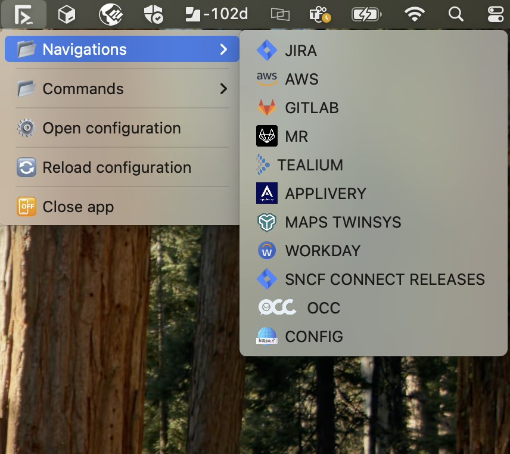

<div>
 
<span 
    style="margin-left: 10px; font-size: 30px; opacity: 0.2; letter-spacing: 2px; text-shadow: 2px 1px 1px #4b1d8e">
FLOWS 
</span>
</div>

## 🚀 Introduction

_**Flows**_ est une _**menu bar app**_ pour macos.

Il permet d'enregistrer et de centraliser les actions habituellement executées telles que la _[navigation vers une page web](#navigations)_ ou l'_[execution d'une commande](#commands)_.  

## ⚙️ Configuration
L'application se construit sur la base de la _⚙️ configuration_ fournie.

Cette configuration est au format `json` et se trouve à l'emplacement suivant : `/$USER/.wfapp/config.json`.

Au premier lancement de l'application l'arborescence suivante :
``` 
.
├── 📂 .wfapp
│   ├── 📄 config.json
│   ├── 📂 icons
```
est créée :

Le dossier `📂 .wfapp` contient les fichiers et sous-dossiers de configuration

Le fichier `📄 config.json` est le fichier de configuration. La structure de configuration attendue est la suivante :  

```json
{
  "path" : "",
  "variables" : {},
  "secrets" : {},
  "navigations" : [
    {
      "name": "",
      "url": "",
      "icon" : ""
    }
  ],
  "commands": [
    {
      "name" : "",
      "cmd" : ""
    }
  ]
}
```

Le dossier `📂 icons` contient les icons utilisées pour les [navigations](#navigations).


<br>

##### 👀 _Petit tour d'horizon sur les différentes propriétés de la configuration_ : 

<details>
<summary>  🛤️  <strong> Path  </strong></summary>
    
C'est la valeur de votre variable d'environnement `$PATH`. Il est utilisé lors de l'exécution des commandes. 

En effet, **_Flows_** n'a pas accès à vos fichiers `.rc`, il n'a donc pas connaissance de votre `$PATH` et ne saurait donc pas retrouver vos différentes commandes.

</details>

<br>

<details>
<summary>  🛢️<strong id="variables"> Variables </strong> </summary>

Les variables sont des valeurs nommées et réutilisables dans les [commands](#commands).

Pour déclarer une variable, il faut lui donner un nom et une valeur 👇

```json
 {
  "variables": {
    "VAR_1" : "value1"
  }
}
```

Pour utiliser une variable, il faut l'encapsuler le nom de la variable dans un `${}`

```
  echo ${VAR_1} 
 ```
</details>

<br>

<details>
<summary>  🤫 <strong>Secrets </strong>  </summary>

Les <span style="color : gray">_secrets_</span> sont des [variables](#variables) dont la valeur n'est pas affichée 
à l'écran lors de l'exécution de la commande.

Ils sont déclarés dons la partie `secrets` de la configuration et sont utilisés de la même manière que les [variables](#variables).

</details>

<br>

<details>
<summary>   🌎 <strong id="navigations">Navigations</strong> </summary>

Le bloc `navigations` contient les **_actions de navigation_** vers une page web, un dossier ou un fichier.

Une action de navigation est modélisée comme suit :

```
- name : String
- url : String
- icon : String (optionel)
```
 - **name** : 
    
   C'est le nom de l'action.


 - **url** :
    
    C'est l'url ou le chemin vers lequel la navigation se fait.


 - **icon** : 

    C'est l'icône représentant l'action. 

    C'est une image placée dans le dossier  `📂 .wfapp/icons`.
    
    La valeur doit contenir l'extension du fichier :  `img.png` par exemple.

🎉 **Le résultat en image** 👇 

<div style="display: flex; justify-content: start; width: auto; height: auto; padding-top: 15px;" >
   
</div>

</details>
<br>

<details>
<summary>   🎬 <strong id="commands">Commands</strong> </summary>
</details>
<br>
